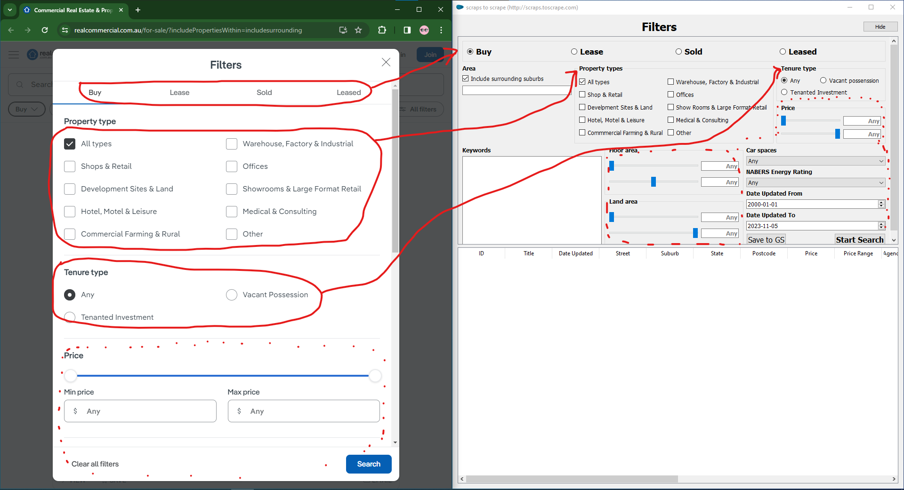
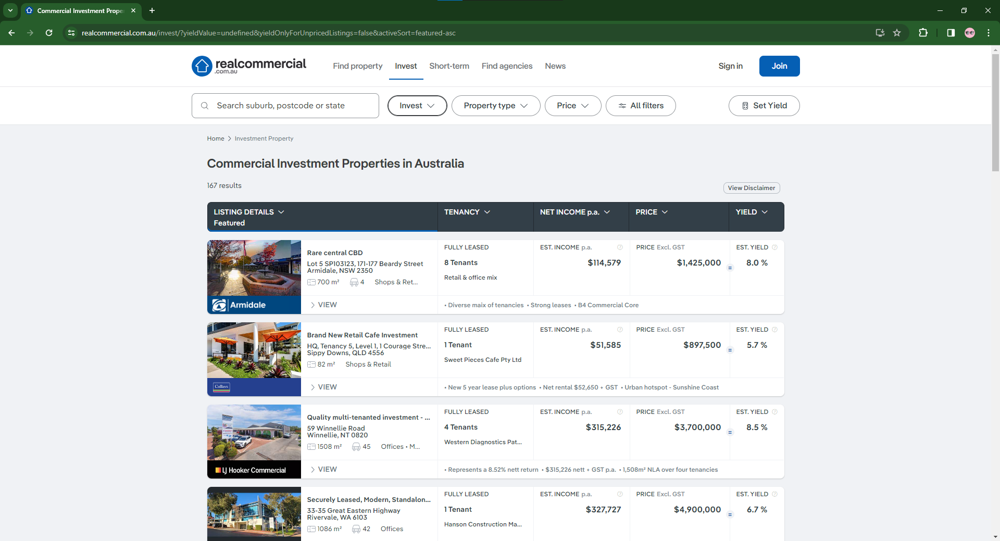
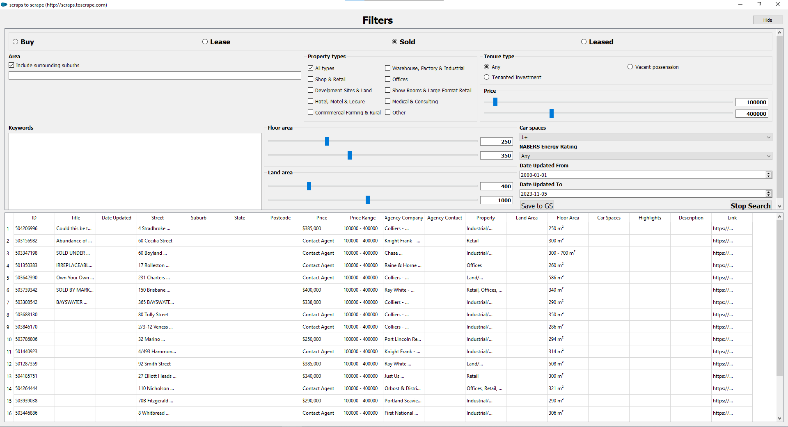

# I scrape detailed information from each filler at https://www.realcommercial.com.au/for-sale/ and store the obtained data.

|  |
|  |
|  |

### requirements
 - Python 3
 - PyQt5
    pip install pyqt5
 - pip install scrapy
 - pip install gspread
 